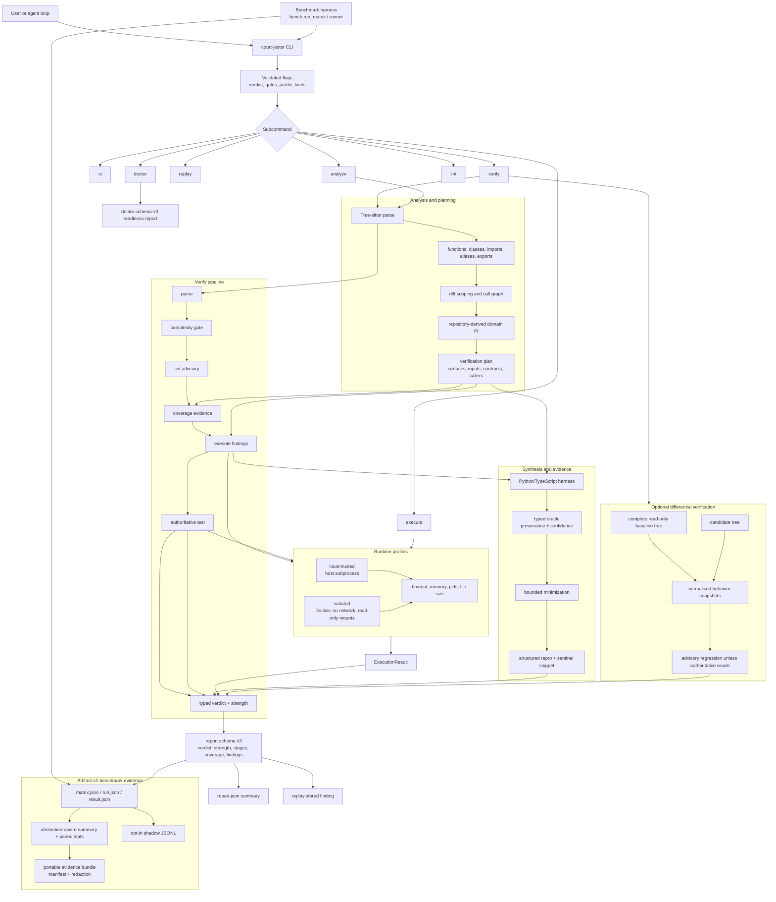

# Court Jester Architecture Diagram

Date: 2026-07-10

Court Jester is a CLI verifier for Python and TypeScript. The Rust binary owns analysis, domain planning, harness generation, runtime execution, typed reports, repair views, and replay. The Python benchmark harness is a separate consumer that measures agent-loop utility and precision.

For the current file-level boundaries, see [Implementation map](code-map.md). The binary delegates to `src/cli/`; verifier decisions, report rendering, replay, and subprocess supervision have dedicated internal modules.

## Boundary notes

- **CLI boundary:** `court-jester` is the product surface. It has no transport server or editor protocol; callers invoke subcommands and consume JSON or human output.
- **Verification contract:** reports use schema v3, typed `pass|fail|inconclusive` verdicts, typed evidence strength, stage statuses, typed findings/oracles, and coverage summaries. Consumers must use these fields rather than reconstructing a verdict from legacy booleans.
- **Coverage:** default `changed-exports` requires changed exported/invocable surfaces (or all exported/invocable surfaces without a diff). Factory/caller reach is distinct from behavioral checking. Tests-only coverage is proven by instrumentation events from the same authoritative test process.
- **Confidence:** source directives, fixtures, and authoritative tests can gate. Name/context inference is low-confidence and advisory by default. Differential changes are advisory without an authoritative oracle.
- **Runtime:** `local-trusted` preserves host execution semantics but is not a security boundary. `isolated` uses Docker resource and filesystem policy; Docker/image/daemon failures are inconclusive and never fall back to local execution.
- **Replay:** findings carry self-contained snippets and structured expectations. Persisted reports add a replay command; differential replay validates embedded source and dependency contracts.
- **Benchmark boundary:** the Python harness copies fixtures, runs providers/policies and public/hidden checks, and writes artifact-v1 matrix/run/result/summary/manifest files requiring verifier schema 3. Evidence bundles are relative, checksummed, and redaction-aware; missing/mixed versions abstain, gates use the shared summary, and local shadow JSONL never changes task success.

The GitHub remote currently retains its historical `court-jester-mcp` URL because the repository rename endpoint returned 404. This is an operational remote contingency, not the product or crate identity; historical benchmark notes may mention MCP isolation only when describing disabled third-party connector state.
