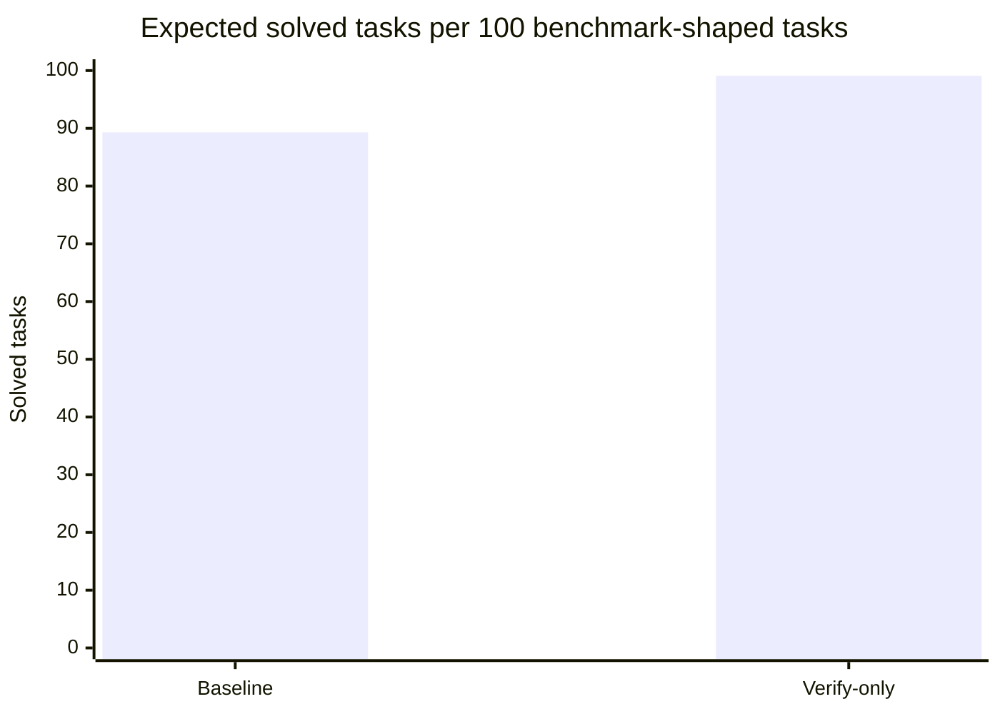
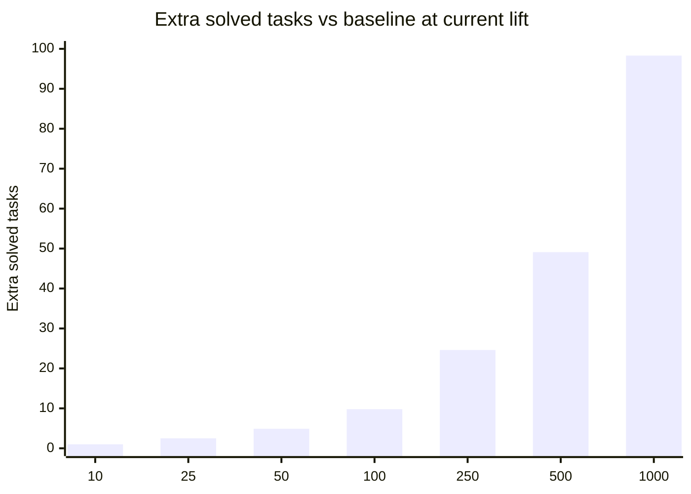

# Court Jester Benchmark Update

Date: 2026-04-18

## Summary

This is the strongest benchmark package in the repo so far.

It combines:

- a much broader false-positive gauntlet
- a repeated `core-current` utility rerun after that verifier tightening

The clean claim is now:

- Court Jester's false-positive story is materially better than it was in the earlier writeups
- `repair-loop-verify-only` still beats `baseline` after that tightening
- the gain is large enough to look real rather than noisy

## Finished False-Positive Controls

Before rerunning the large utility matrix, we expanded the precision controls in two directions:

- local known-good tasks
- upstream-derived gold-patch replay tasks

### Local Known-Good Corpus

Artifact:

- [2026-04-18-known-good-corpus-r10](/Users/spencerlee/court-jester-mcp/bench/results/matrix/2026-04-18-known-good-corpus-r10)

Run:

- task set: `known-good-corpus`
- model: `noop`
- policy: `required-final`
- repeats: `10`

Result:

- `80 / 80`

### External Known-Good Replay

Authoritative artifact:

- [/tmp/cj-external-known-good-replay-r10-v2](/tmp/cj-external-known-good-replay-r10-v2)

Run:

- task set: `external-known-good-replay`
- model: `noop`
- policy: `required-final`
- repeats: `10`
- replay mode: `--use-task-gold-patches`

Result:

- `190 / 190`

This replay lane now covers `19` upstream-derived tasks across:

- requests-style cookies
- Python packaging
- node-semver
- lodash
- `qs`
- fresh Express slices

Important artifact note:

- the first repo-local replay run surfaced a path-sensitive gold-patch issue when the output workspace lived under the main git checkout
- the rerun in `/tmp` is the authoritative result
- that was a benchmark-output-location issue, not a Court Jester semantic regression

### Precision Read

The full false-positive gauntlet is now:

- `270 / 270` total clean control passes
- `80 / 80` local known-good
- `190 / 190` external upstream replay

That is a much stronger precision story than the earlier `20 / 20` known-good headline.

## Repeated Core Utility Rerun

Artifact:

- [2026-04-18-core-current-r3-v2](/Users/spencerlee/court-jester-mcp/bench/results/matrix/2026-04-18-core-current-r3-v2)

Run:

- task set: `core-current`
- tasks: `39`
- models: `claude-default`, `codex-default`
- policies: `baseline`, `repair-loop-verify-only`
- repeats: `3`
- total cells: `468`
- schedule: `blocked-random`
- shuffle seed: `7`

Final result:

| Model | Baseline | Verify-only | Lift |
| --- | --- | --- | --- |
| `claude-default` | `102 / 117` | `116 / 117` | `+14` |
| `codex-default` | `107 / 117` | `116 / 117` | `+9` |

Aggregate:

- baseline: `209 / 234`
- verify-only: `232 / 234`
- absolute gain: `+23` successes

Success-rate read:

- baseline: `89.3%`
- verify-only: `99.1%`
- absolute lift: `+9.8` percentage points
- relative lift: `+11.0%`

This is materially stronger than the earlier `71 / 78 -> 76 / 78` strict verify-only run.

## Repair Attribution

Inside the verify-only arm:

- Claude verify-triggered repairs: `14`
- Claude repaired after verify failure: `13`
- Codex verify-triggered repairs: `17`
- Codex repaired after verify failure: `16`

Aggregate:

- `31` repair rounds were triggered by `court-jester verify`
- `29` of those ended in final success

That matters because the loop is not just getting lucky on second attempts. The repair attempts are being triggered by verifier failures, not by public or hidden evaluator feedback.

The current verify-only trigger sources are:

- Claude: `{"verify": 14}`
- Codex: `{"verify": 17}`

So the clean mechanism read is:

- Court Jester is causing the extra attempt
- the model is often converting that verifier feedback into a correct final patch

## Remaining Failures

The result is strong, but not a perfect sweep.

Remaining verify-only non-successes:

- `claude-default`: `1` `verify_caught_hidden_bug`
- `codex-default`: `1` `hidden_semantic_miss`

Baseline remains much worse:

- Claude baseline hidden semantic misses: `15`
- Codex baseline hidden semantic misses: `10`

So the right interpretation is:

- Court Jester is converting a large fraction of baseline hidden semantic misses into real final wins
- it is not eliminating every hard semantic miss

## Scenario Read

The aggregate lift is easiest to reason about as "extra solved tasks per N benchmark-shaped tasks."

### Per 100 Tasks

```text
Expected solved tasks per 100 benchmark-shaped tasks

baseline     89.3
verify-only  99.1
saved         9.8
```



### Extra Solved Tasks At Different Volumes

| Situation | Task volume | Baseline solves | Verify-only solves | Extra solved tasks |
| --- | ---: | ---: | ---: | ---: |
| solo debugging burst | `10` | `8.9` | `9.9` | `+1.0` |
| small sprint slice | `25` | `22.3` | `24.8` | `+2.5` |
| busy solo or pairing day | `50` | `44.7` | `49.6` | `+4.9` |
| small team week | `100` | `89.3` | `99.1` | `+9.8` |
| larger eval batch | `250` | `223.3` | `247.9` | `+24.6` |
| sustained internal usage | `500` | `446.6` | `495.7` | `+49.1` |
| large benchmark packet | `1000` | `893.2` | `991.5` | `+98.3` |



### By Model Family

If you want a rough model-weighted intuition instead of the mixed aggregate:

- Claude-heavy usage looked like `87.2% -> 99.1%`, a `+12.0` point lift
- Codex-heavy usage looked like `91.5% -> 99.1%`, a `+7.7` point lift

So the current mixed headline number is not being carried by only one side. The gain is larger on Claude, but still real on Codex.

## Why This Package Is Stronger

The earlier benchmark could still leave room for a skeptical read:

- maybe the verifier got more aggressive
- maybe the utility result would disappear once false positives were tightened
- maybe the original strict run was too small to trust

This package answers those concerns in the right order:

1. expand precision controls first
2. confirm they stay clean at scale
3. rerun the main utility suite after that tightening
4. check whether verify-only still beats baseline

That is a much stronger benchmark shape than leading only with the old `76 / 78` result.

## What We Can Claim Now

Supported by this package:

- Court Jester has a materially stronger false-positive story than it had before
- the broad precision gauntlet is currently clean on both local known-good and upstream replay controls
- `repair-loop-verify-only` still produces a strong end-to-end lift after that verifier tightening
- the lift is not explained by public or hidden evaluator feedback driving repair

Still not proven by this package alone:

- broad readiness on arbitrary external repos
- that verify-guided repair beats every public-test or blind-retry ablation in every setting
- that the remaining two verify-only misses are representative of the whole residual error surface

## Commands

Control lanes:

```bash
python3 -m bench.run_matrix \
  --task-set known-good-corpus \
  --models noop \
  --policies required-final \
  --repeats 10 \
  --schedule blocked-random \
  --output-dir bench/results/matrix/2026-04-18-known-good-corpus-r10

python3 -m bench.run_matrix \
  --task-set external-known-good-replay \
  --models noop \
  --policies required-final \
  --repeats 10 \
  --schedule blocked-random \
  --use-task-gold-patches \
  --output-dir /tmp/cj-external-known-good-replay-r10-v2
```

Utility rerun:

```bash
python3 -m bench.run_matrix \
  --task-set core-current \
  --models claude-default,codex-default \
  --policies baseline,repair-loop-verify-only \
  --repeats 3 \
  --schedule blocked-random \
  --shuffle-seed 7 \
  --output-dir bench/results/matrix/2026-04-18-core-current-r3-v2
```
