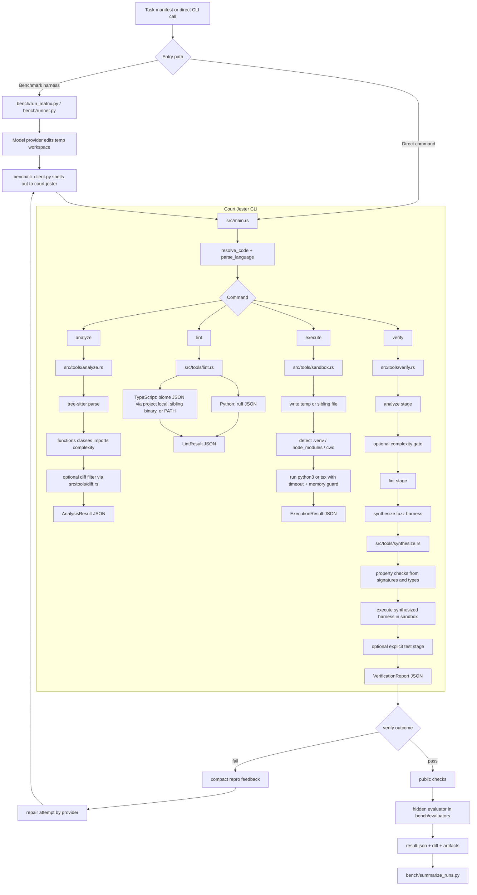

# Court Jester Tool And Flow Diagram

Date: 2026-04-10

## Reading Notes

- `analyze`, `lint`, `execute`, and `verify` are CLI commands.
- `verify` is the main product loop: `analyze -> lint -> synthesize -> execute -> optional tests`.
- `diff` and `synthesize` are internal modules that support `analyze` and `verify`.
- The benchmark harness uses `verify` as either a gate or a repair-loop trigger before hidden evaluation.
